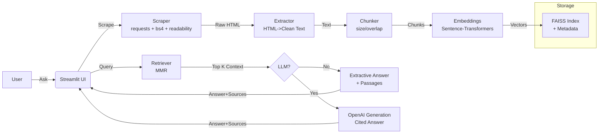

# InfoChatAgent — POC Documentation

This document summarizes the Proof of Concept (POC) for InfoChatAgent — a web scraping + retrieval augmented generation (RAG) agent with a Streamlit UI. It scrapes a target page (and optionally follows the top N links), builds a local vector index, and answers questions with citations and inline passages.

## 1. Objectives
- Demonstrate end-to-end scraping of a public web page or static HTML files.
- Convert content to clean text, chunk, embed, and index locally.
- Query via a Streamlit UI, returning grounded answers with sources.
- Provide a simple roadmap for MVP → Production.

## 2. High-level Features
- Static web scraping using `requests` + `readability-lxml` + `BeautifulSoup`.
- Optional mini-crawler to follow top N Stack Overflow question links.
- Cleaning and chunking with configurable size/overlap.
- Embeddings via `sentence-transformers` (default `all-MiniLM-L6-v2`).
- FAISS vector index with persisted metadata.
- Retriever with MMR diversification for better coverage.
- Optional OpenAI generation (Responses API) for fluent, grounded answers.
- Streamlit UI with:
  - Summary bullets
  - Top Insights (common issues and frequent terms)
  - Sources and inline passages

## 3. Architecture (Mermaid)


## 4. Directory Structure
```
.
├── app.py                         # Streamlit UI
├── cli.py                         # CLI for scrape/index/ask
├── requirements.txt
├── README.md
├── .env.sample
├── data/                          # Docstore JSONL
├── indexes/                       # FAISS + metadata
├── src/
│   └── infochat_agent/
│       ├── __init__.py
│       ├── config.py              # Config (env-driven)
│       ├── scrape.py              # Scraping + mini-crawler + robots + caching
│       ├── processing.py          # Chunking utilities
│       ├── embeddings.py          # Sentence-Transformers wrappers
│       ├── index.py               # FAISS build/load/search
│       └── rag.py                 # RAG pipeline + MMR + OpenAI (optional)
└── docs/
    └── POC.md                     # This document
```

## 5. How It Works
1) Scrape target page (e.g., Stack Overflow tag page) and optionally follow the top N question links.
2) Extract clean readable text using Readability and BeautifulSoup.
3) Chunk text into overlapping windows; embed with Sentence-Transformers.
4) Persist embeddings in FAISS with aligned JSONL metadata.
5) Query: retrieve a larger pool, apply MMR to select diverse top K.
6) Answer: extractive display (passages) or LLM-generated summary if OpenAI is configured.

## 6. Setup and Run
- Create virtual environment and install dependencies:
```
python3 -m venv .venv
source .venv/bin/activate
pip install -r requirements.txt
```
- (Optional) For LLM generation, create `.env` and set `OPENAI_API_KEY`.
- Launch UI:
```
streamlit run app.py
```
- In the sidebar, toggle “Follow top StackOverflow question links”, set a limit, click “Scrape & Build Index”, then ask questions.

## 7. Demo Script
- Open the Streamlit app.
- Use default URL `https://stackoverflow.com/questions/tagged/python`.
- Enable "Follow top StackOverflow question links" and set 10–20.
- Click "Scrape & Build Index".
- Ask: “What common issues are discussed on these Python pages?”
- Observe: Summary bullets, Top Insights, Sources with inline passages.

## 8. Roadmap
- MVP Complete:
  - Static scraping, mini-crawler, chunking, FAISS, MMR retriever, Streamlit UI.
- Short-term Enhancements:
  - Cross-encoder reranker (HF/Cohere) for precision.
  - Better link discovery, sitemap support, domain allowlist.
  - UI polish: saved runs, export report (PDF/Markdown), caching controls.
- Multimodal Extension:
  - OCR (Tesseract/PaddleOCR) to ingest images with text.
  - Optional image embeddings; multimodal LLM support.
- Production Hardening:
  - Robust logging, metrics, retries, backoff.
  - Dockerfile and CI/CD; infra as code.
  - Authentication for UI; rate limits; content policy.

## 9. Non-Goals (POC)
- Full JS rendering (consider Playwright in future).
- Enterprise auth/SSO.
- Long-term storage and governance.

## 10. Risks / Mitigations
- Dynamic pages may yield little text.
  - Mitigation: follow links and/or add Playwright.
- LLM hallucinations.
  - Mitigation: grounded prompts; always show citations; allow extractive mode.
- Rate limiting / robots constraints.
  - Mitigation: obey robots.txt; add rate limiting and caching.

## 11. Submission Bundle
- Include source tree and this POC doc.
- Suggested ZIP contents:
  - `src/`, `app.py`, `cli.py`, `requirements.txt`, `.env.sample`, `README.md`, `docs/POC.md`.
- To zip on Linux/macOS:
```
zip -r infochatagent_poc.zip src app.py cli.py requirements.txt .env.sample README.md docs
```
